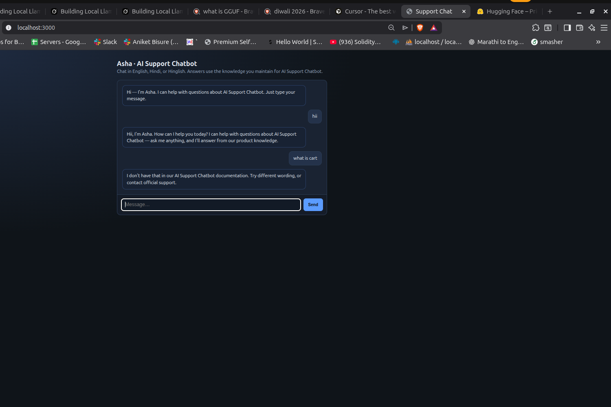

# ShopNest — Customer help & support (e‑commerce)

**ShopNest** is our online shopping app and website. We sell fashion, electronics, home essentials, and daily needs from verified sellers across India. This document is the **official support reference** for common customer questions.

> **Assistant note:** Answer using only what appears here. If a detail is not listed, say the customer should check the latest info in the app or contact support.

---

## Account, login, and security

You need a ShopNest account to place orders. Sign up with **mobile number** or **email**, then verify with OTP.

**Forgot password:** Use **Forgot password** on the login screen. We send a reset link or OTP to your registered email or phone. The link expires in **15 minutes**.

**Change phone or email:** Go to **Profile → Account details**. You may need to verify the new contact with OTP. For security, some changes are limited if you have open pay-later or wallet balances.

**Logout everywhere:** **Profile → Security → Sign out of all devices** (if available in your app version).

**Suspicious activity:** If you see orders you did not place, change your password immediately and use **Help → Report a problem** with order IDs if any.

---

## Browsing, search, and product pages

Use **Search** or **Categories** to find products. Filters (price, brand, rating, delivery speed) help narrow results.

**Product details** show price (inclusive of applicable taxes where shown), seller name, estimated delivery date, return policy for that category, and customer reviews.

**Out of stock:** You can tap **Notify me** if the option appears; we alert you when the item is back.

**Deals and coupons:** Valid coupons apply at checkout. Each coupon has rules (minimum order value, category, expiry). Only one bank/wallet offer may apply per order where the app allows.

---

## Cart and checkout

**Cart:** The cart is **created by Smasher**. It holds your items until you checkout or remove them. Prices can change until payment is confirmed.

**Address:** Add or pick a delivery address. Pincode serviceability is checked automatically. Wrong pincode may show **Delivery not available** — correct the address or try another pincode.

**Payment options** (availability depends on your account and region):

- **UPI** (Google Pay, PhonePe, Paytm, etc.)
- **Debit / credit cards**
- **Net banking**
- **Wallets** linked in the app
- **Cash on delivery (COD)** — where offered; a small platform fee may apply on COD as shown before you pay
- **EMI / pay later** — subject to partner approval at checkout

**Failed payment:** Money is not taken for a failed transaction. If your bank shows a hold, it usually reverses in **3–7 business days** per bank rules. For duplicate charges, share the bank/UPI reference from your statement via **Order help**.

---

## Orders: place, confirm, and invoice

After successful payment, you see **Order confirmed** with an **order ID** (e.g. `SN-7K2M9P`). A confirmation goes to your registered email/SMS.

**Invoice / GST invoice:** For eligible orders, open **My orders → Order details → Download invoice** when available. Business customers should ensure GSTIN is saved in **Profile** before ordering if required.

**Order under processing:** We pack and hand over to the courier. Status updates appear in **My orders**.

**Partial shipment:** Large or multi-seller orders may ship in parts. Each shipment has its own tracking ID when split.

---

## Shipping, delivery, and tracking

**Delivery time** shown at checkout is an **estimate** based on your pincode and seller location. Weather, holidays, or courier delays can change dates.

**Track order:** **My orders → Track** shows courier name, tracking ID, and last scan. You may also get SMS with tracking links.

**Could not deliver:** If you were unavailable, the courier may retry or ask you to reschedule in the app. Repeated failed attempts may return the item to the seller; refunds follow return policy timelines.

**Open box not accepted:** For some electronics, courier may ask you to accept only after verification policy shown on the product page.

---

## Cancellations

**Before shipment:** Open **My orders → Cancel order** if the button is active. Refund goes to the **original payment method** (UPI/card/bank) unless the order used COD (nothing to refund).

**After shipment:** You cannot cancel from the app; refuse at doorstep if policy allows, or **return** after delivery per category rules.

**Seller-cancelled orders:** If we cancel (stock or compliance), you get a full refund automatically to the original source; timelines below apply.

---

## Returns, replacements, and refunds

Policies vary by **category** (e.g. innerwear, perishables may be non-returnable). Always read **Returns** on the product page before buying.

**Typical window:** **7 days** from delivery for many items, **10–30 days** for some categories, unless marked **Non-returnable**.

**How to start a return:** **My orders → Return / Replace** → choose reason → pick pickup slot if available. Keep product **unused**, with **tags**, **original packaging**, and **invoice** where required.

**Refund modes:**

- **Original payment method** — usual timeline **5–7 business days** after we receive and verify the item
- **ShopNest wallet** — may be faster when you choose wallet credit at return initiation

**Wrong or damaged item:** Choose **Wrong item delivered** or **Damaged** with photos within the allowed window. We may offer **replacement** or **refund** after verification.

**Pickup failed:** If pickup is missed, reschedule from **My orders** or contact support with your return ID.

---

## Wallet and gift cards

**ShopNest Wallet** stores refunds and promotional credits where applicable. Wallet balance can be used on eligible purchases at checkout.

**Gift cards / vouchers:** Redeem in **Wallet or Payments** as per card terms. They may not be cash-reversible.

---

## Payments, charges, and disputes

**Platform or convenience fee** (if any) is shown **before** you pay. Taxes (GST) appear as per regulations.

**Bank offers:** Cashback or discounts are between you and the bank/wallet partner; ShopNest only facilitates the payment. If cashback is missing, contact your bank with the transaction reference.

**Charge dispute:** Share **order ID**, **payment date**, and **UPI/bank ref no.** via **Help** for investigation.

---

## Privacy and data (customer-facing summary)

We use your data to **process orders**, **deliver**, **prevent fraud**, and **improve** the service. You can manage **marketing** preferences in **Profile → Notifications**. Full policy is linked in the app footer (**Privacy policy**).

---

## Contact and escalation

**In-app chat:** **Help → Chat with us** (hours may vary; typical **9:00 – 21:00** IST on weekdays).

**Email:** **support@shopnest.example** — include **registered phone/email** and **order ID** for faster help.

**Response time:** We aim to reply within **24–48 hours** on email; urgent delivery issues are prioritized when you contact us from the **order** screen.

**Grievance:** For unresolved issues, use **Help → Escalate** and share your ticket ID.

---

## Quick phrases (how customers ask)

- *“Mera order kab aayega?”* — Check **Track order** for ETA; delays may happen during sales or bad weather.
- *“Return kaise karun?”* — **My orders → Return** within the return window for your item category.
- *“Refund kab milega?”* — After we receive the return, usually **5–7 business days** to bank/UPI; wallet may be quicker.
- *“Payment fail ho gaya.”* — Retry; if money was debited, bank reversal typically takes **3–7 days**; contact support with reference if needed.
- *“Wrong item mila.”* — Start **Return / Replace** with photos and order ID.

---

## Summary

ShopNest helps you **shop**, **pay safely**, **track deliveries**, and **return or replace** items per policy. For anything not covered here, use **Help** in the app or email support with your **order ID**.
